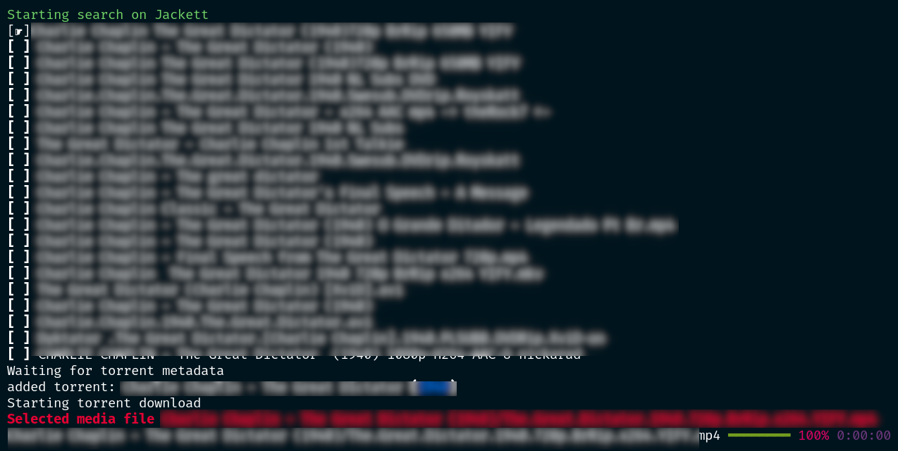

.. raw:: html

   

.. image:: http://i.imgur.com/ofx75lO.png

CLI client to torrent searches and streaming. Easily **search torrents** in
multiple providers such as KickAssTorrents, ThePirateBay, and any Jackett
provider.

.. raw:: html

   

|pypi| |release| |downloads| |python_versions| |pypi_versions| |actions|

.. |pypi| image:: https://img.shields.io/pypi/l/katcr
.. |release| image:: https://img.shields.io/librariesio/release/pypi/katcr
.. |downloads| image:: https://img.shields.io/pypi/dm/katcr
.. |python_versions| image:: https://img.shields.io/pypi/pyversions/katcr
.. |pypi_versions| image:: https://img.shields.io/pypi/v/katcr
.. |actions| image:: https://github.com/XayOn/katcr/workflows/CI%20commit/badge.svg
    :target: https://github.com/XayOn/katcr/actions

Table of contents
=================

.. contents::
  :local:
  :depth: 3

.. _features:

Features
--------

- Display results in a nice utf-8 table
- Interactive mode, choose and open torrent with a nice text user interface
- Open torrent directly with your preferred client (via xdg-open)
- Stream torrent with `torrentstream <https://github.com/XayOn/torrentstream>`_
- Searches on all available engines until it gets results
- Search torrents in:

  + Eztv
  + `Jackett <https://github.com/Jackett/Jackett>`_
  + Katcr
  + NyaaSi
  + Skytorrents
  + ThePirateBay

.. code:: bash

    poetry run katcr search --engines Jackett "Big Buck Bunny" --stream

Installation
------------

This is a python package available on pypi, just run

.. code:: bash

    pip install katcr

Or, with streaming (see `Streaming <streaming_>`_)

Make sure your python version is at least python3.8 and you're using that
version's pip.

Usage
-------

Exposes a `katcr search` command.

--pages
    (optional) Number of pages to search for in each engine (Except on Jackett)

--engines
    (optional) Engines available. See `Features <features_>`_ section

--nointeractive
    (optional) Do not open text user interface, just print all the results

--open
    (optional) Use xdg-open to open magnet link. For example to download it
    with your preferred torrent download client.

--stream
    (optional) Use torrentstreaming to stream. See `Streaming <streaming_>`_ section

::

        USAGE
          katcr search [--pages <...>]  [--engines <...>] [--nointeractive [<...>]]
                       [--open [<...>]] [--stream [<...>]] <search>

        ARGUMENTS
          <search>               Search term

        OPTIONS
          --pages                Pages to search on search engines (default: "1")
          --engines              Engines (default: "Katcr,ThePirateBay,Eztv,NyaaSi,Skytorrents")
          --nointeractive        Print results directly to stdout
          --open                 Open selected magnet with xdg-open
          --stream               Stream with torrentstream, plays using PLAYER envvar or xdg-open

        GLOBAL OPTIONS
          -h (--help)            Display this help message
          -q (--quiet)           Do not output any message
          -v (--verbose)         Increase the verbosity of messages: "-v" for normal output, "-vv" for more verbose output
                                 and "-vvv" for debug
          -V (--version)         Display this application version
          --ansi                 Force ANSI output
          --no-ansi              Disable ANSI output
          -n (--no-interaction)  Do not ask any interactive question

.. _streaming:

Streaming
---------

Streaming requires `libtorrent <https://www.libtorrent.org/>`_ . 
With libtorrent installed, you'll need to install katcr's streaming extras, for
that matter, install it with [stream], 

.. code:: bash

    pip install katcr[stream]

Then, just run it with 

.. code:: bash

    poetry run katcr search --engines Jackett "Big Buck Bunny" --stream

.. _jackett:

Jackett Support
---------------

You can easily use a `Jackett <https://github.com/Jackett/Jackett>`_ instance
to search on all your configured provider.

This allows you to search on any jackett-supported site (that's about supported
300 trackers). **Jackett** is probably the best way to use this software, as it
has a more active mantainance of the tracker sites.

To enable Jackett use, simply export your jackett URL and TOKEN as variables

.. code:: bash

   JACKETT_HOST=http://127.0.0.1:9117 JACKETT_APIKEY=<redacted> poetry run katcr --engines=

Or, on a more permanent basis, write a config file on your
`${XDG_CONFIG_HOME}/katcr.ini` (wich is usually located at
`~/.local/share/katcr.ini`) with host and apikeys values:

.. code:: ini

    [jackett]
    host = http://127.0.0.1
    apikey = 12345 
    # host = https://127.0.0.1
    # host = https://127.0.0.1/prefix/
    # ssl and prefix supported

Notes
------

I like :star:, starr this project to show your appreciation! 

This project does not promote piracy. You can find a list of good public domain
movies that are available as torrents at `public domain torrents
<https://www.publicdomaintorrents.info/>`_.

Logo is based on robot cat by
`Arsenty <https://thenounproject.com/arsenty/>`_
