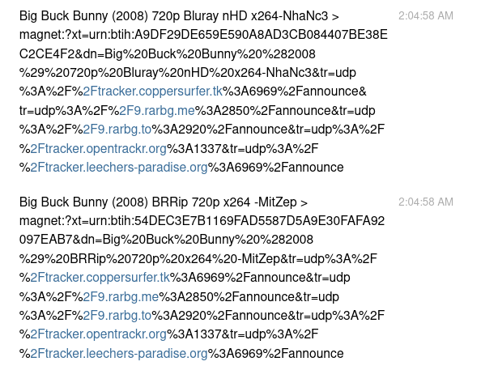

.. image:: http://i.imgur.com/ofx75lO.png

CLI client to torrent searches and streaming. Easily **search torrents** in
multiple providers such as KickAssTorrents, ThePirateBay, and any Jackett
provider.

|pypi| |release| |downloads| |python_versions| |coverage| |pypi_versions| |aur_package| |actions|

.. |pypi| image:: https://img.shields.io/pypi/l/katcr
.. |release| image:: https://img.shields.io/librariesio/release/pypi/katcr
.. |downloads| image:: https://img.shields.io/pypi/dm/katcr
.. |python_versions| image:: https://img.shields.io/pypi/pyversions/katcr
.. |pypi_versions| image:: https://img.shields.io/pypi/v/katcr
.. |aur_pacakge| image:: https://img.shields.io/aur/version/katcr
    :target: https://aur.archlinux.org/packages/katcr
.. |coverage| image:: https://codecov.io/gh/XayOn/katcr/branch/develop/graph/badge.svg
    :target: https://codecov.io/gh/XayOn/katcr
.. |actions| image:: https://github.com/XayOn/katcr/workflows/CI%20commit/badge.svg
    :target: https://github.com/XayOn/katcr/actions

Table of contents
=================

.. contents::
  :local:
  :depth: 3

.. _features:

Features
--------

- Display results in a nice utf-8 table
- Interactive mode, choose and open torrent with a nice text user interface
- Open torrent directly with your preferred client (via xdg-open)
- Stream torrent with `torrentstream <https://github.com/XayOn/torrentstream>`_
- Searches on all available engines until it gets results
- Search torrents in:

  + Eztv
  + `Jackett <https://github.com/Jackett/Jackett>`_
  + Katcr
  + NyaaSi
  + Skytorrents
  + ThePirateBay

.. code:: bash

    poetry run katcr search --stream --engine Jackett --engine ThePirateBay "Big Buck Bunny" 

.. code:: bash

    poetry run katcr search --stream --engine Jackett:eztv "Big Buck Bunny" 

.. image:: ./docs/stream.png

Installation
------------

This is a python package available on pypi, just run

.. code:: bash

    pip install katcr

Or, with streaming (see `Streaming <streaming_>`_)

Make sure your python version is at least python3.8 and you're using that
version's pip.

On archlinux, you can install it from AUR
(https://aur.archlinux.org/packages/katcr/), with your favourite aur package
installer, such as yay.

.. code:: bash

    yay -S katcr

Usage
-------

Exposes a `katcr search` command.

--pages
    (optional) Number of pages to search for in each engine (Except on Jackett)

--engine
    (optional) Engines available. See `Features <features_>`_ section. You can
    use this option multiple times (as in --engine Eztv --engine ThePirateBay)

--nointeractive
    (optional) Do not open text user interface, just print all the results

--open
    (optional) Use xdg-open to open magnet link. For example to download it
    with your preferred torrent download client.

--stream
    (optional) Use torrentstreaming to stream. See `Streaming <streaming_>`_ section

::

        USAGE
          katcr search [--pages <...>]  [--engine <...>] [--nointeractive [<...>]]
                       [--open [<...>]] [--stream [<...>]] <search>

        ARGUMENTS
          <search>               Search term

        OPTIONS
          --pages                Pages to search on search engines (default: "1")
          --engine               Engines (multiple values allowed) 
          --nointeractive        Print results directly to stdout
          --open                 Open selected magnet with xdg-open
          --stream               Stream with torrentstream, plays using PLAYER envvar or xdg-open

        GLOBAL OPTIONS
          -h (--help)            Display this help message
          -q (--quiet)           Do not output any message
          -v (--verbose)         Increase the verbosity of messages: "-v" for normal output, "-vv" for more verbose output
                                 and "-vvv" for debug
          -V (--version)         Display this application version
          --ansi                 Force ANSI output
          --no-ansi              Disable ANSI output
          -n (--no-interaction)  Do not ask any interactive question

.. _streaming:

Streaming
---------

Streaming requires `libtorrent <https://www.libtorrent.org/>`_ . 
With libtorrent installed, you'll need to install katcr's streaming extras, for
that matter, install it with [stream], 

.. code:: bash

    pip install katcr[stream]

Then, just run it with 

.. code:: bash

    poetry run katcr search --engine Jackett "Big Buck Bunny" --stream

Jackett Support
---------------

You can easily use a `Jackett <https://github.com/Jackett/Jackett>`_ instance
to search on all your configured provider.

This allows you to search on any jackett-supported site (that's about supported
300 trackers). **Jackett** is probably the best way to use this software, as it
has a more active mantainance of the tracker sites.

To enable Jackett use, simply export your jackett URL and TOKEN as
environmental variables

You can search on individual jackett providers by specifying the provider
separated by ":", as in:

.. code:: bash

    poetry run katcr --engine=jackett:thepiratebay "Big Buck Bunny"

Note that you need to have the provider configured correctly in jackett.

.. code:: bash

   JACKETT_HOST=http://127.0.0.1:9117 JACKETT_APIKEY=<redacted> poetry run katcr --engine=jackett "Big Buck Bunny"

Or, for a more permanent solution, write a config file to
`${XDG_CONFIG_HOME}/katcr.ini` (wich is usually
`~/.config/katcr.ini`) with the host and apikeys values:

.. code:: ini

    [jackett]
    host = http://127.0.0.1
    apikey = 12345 
    # host = https://127.0.0.1
    # host = https://127.0.0.1/prefix/
    # ssl and prefix supported

Bot
---

Katcr comes with a bot command, connecting to telegram

To start a katcr bot, you need a bot token from the GodFather.
Open a conversation to `GodFather <https://t.me/botfather/>`_  to get more
information on how to get a token.

Just launch the bot with --token=your_token

.. code:: bash

        USAGE
        console bot [--token [<...>]]

        OPTIONS
          --token                Bot token. Ask BotFather

        GLOBAL OPTIONS
          -h (--help)            Display this help message
          -q (--quiet)           Do not output any message
          -v (--verbose)         Increase the verbosity of messages: "-v" for normal output, "-vv" for more verbose output
                                 and "-vvv" for debug
          -V (--version)         Display this application version
          --ansi                 Force ANSI output
          --no-ansi              Disable ANSI output
          -n (--no-interaction)  Do not ask any interactive question

Docker
------

Katcr comes docker-ready, to execute it, just run:

.. code:: bash

        docker run xayon/katcr search --engine ThePirateBay "Big Buck Bunny"

Notes
------

I like :star:, star this project to show your appreciation! 

Disclaimer
++++++++++++

This project does not promote piracy. You can find a list of good public domain
movies that are available as torrents at `public domain torrents
<https://www.publicdomaintorrents.info/>`_.

Logo
++++

Logo is based on robot cat by
`Arsenty <https://thenounproject.com/arsenty/>`_

Contributors
++++++++++++

.. raw:: html

        

Made with `contributors-img <https://contributors-img.web.app>`_
